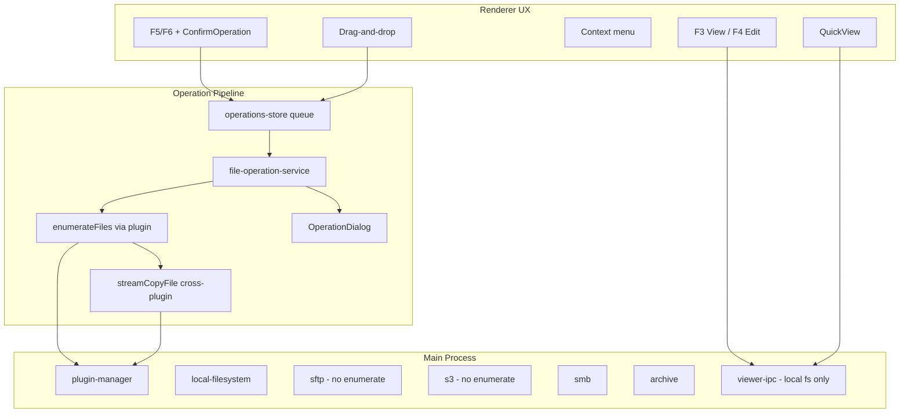

# Something Commander — Robustness Plan

A plan to fix UX issues around file operations, viewer/editor, keyboard handling, and cross-plugin workflows.

**Version:** 0.1  
**Date:** 2026-06-19

---

## Current Architecture



**Operations flow:** confirm (sometimes) → enqueue → enumerate → per-file stream copy → refresh panels.

**Viewer flow:** F3/F4 pass `entry.id` to IPC that calls `fs.stat` / `fs.open` directly — only works for local paths.

---

## Root Causes

### P0 — Broken or stuck operations

| Issue | What happens | Where |
|-------|----------------|-------|
| **SFTP/S3 copy/move fails** | `enumerateFiles` throws; op stuck in `enumerating`; queue blocked forever | SFTP/S3 have `createReadStream`/`writeFromStream` but **no `enumerateFiles`** |
| **Unhandled enumeration errors** | Same stuck state for any enumeration failure | `file-operation-service.ts` — no try/catch around `enumerateFiles` |
| **Cancelled ops block queue** | Cancel during `enumerating` leaves status `enumerating`/`cancelled`; `tryStart()` won't pick next op | `file-operation-service.ts` + queue guard |
| **Silent empty copies** | Unreadable sources skipped in local `enumerateFiles`; op completes with 0 files, no warning | `local-filesystem/index.ts` `catch { /* skip */ }` |

### P0 — Viewer/editor only work locally

F3, F4, QuickView, and context-menu View all pass `entry.id` to IPC that calls `fs.stat` / `fs.open` directly. Remote entries use IDs like `user@host:22::/remote/path` or `bucket::prefix/file` — not valid local paths. Archive-internal files (`archive.zip::folder/file.txt`) fail the same way.

There are **two viewer implementations**: unused inline `FileViewer.tsx` and the separate-window `ViewerPage.tsx` — both local-only.

### P0 — Escape and keyboard UX broken

| Issue | What happens | Where |
|-------|----------------|-------|
| **Viewer Escape unreliable** | Handler on root `div` only fires when root has focus; no auto-focus on mount | `ViewerPage.tsx` |
| **Search input steals Escape** | Focus in search box; no blur-first pattern | `ViewerPage.tsx` |
| **Editor Escape textarea-only** | No window-level listener; loading/error states unhandled | `EditorPage.tsx` |
| **Main window Escape overloaded** | `useKeyboard` handles Escape as folder-calc cancel and returns early; `cancel` keybinding never dispatched | `useKeyboard.ts`, `keybindings-store.ts` |
| **Per-dialog Escape roll-your-own** | Mix of capture/bubble listeners; some disable `Modal` Escape and reimplement | Various dialogs |
| **OperationDialog Escape ambiguous** | Escape cancels running copy but doesn't dismiss finished/error state | `OperationDialog.tsx` |

### P1 — Inconsistent operation UX

| Gap | Impact |
|-----|--------|
| **Drag-drop skips confirmation** | F5/F6 show `ConfirmOperation`; drag enqueues immediately |
| **Context menu copy/move/delete broken** | Menu sets cursor but doesn't dispatch commands (`FileList.tsx`) |
| **No feedback on silent early returns** | F5/F6 with no selection, no dest panel — return silently |
| **Success is invisible** | Completed ops call `removeOperation` with no toast |
| **Errors only in dialog** | Easy to miss if minimized; refresh errors swallowed (`panel-store.ts`) |

### P1 — Copy operation correctness gaps

- **Overwrite prompts only for local destinations** — `checkExists`/`getFileInfo` are local `fs` calls.
- **Source date always 0** in overwrite UI.
- **Cancel doesn't abort in-flight stream** — only checked between files.
- **Move is non-atomic** — copy then delete source; failure mid-move leaves duplicates.
- **No preflight validation** — copy into self/subfolder, invalid dest, unsupported plugin combo.

### P2 — Polish and maintainability

- Duplicate `handleActivate` in `App.tsx` vs `FilePanel.tsx`.
- `readFileChunk` decodes binary as UTF-8 — corrupts large text at chunk boundaries.
- Global single `overwriteResolve` promise — fragile if dialog minimized.
- Native drag on local files may conflict with internal panel drop.
- `FileViewer.tsx` dead code; search in viewer doesn't highlight matches.
- Editor uses `window.confirm` for unsaved changes.

---

## Plan Phases

### Phase 0.5 — Keyboard & overlay UX (~1–2 days)

Quick wins with high perceived impact. Independent of plugin-read work.

#### PR 0.5.1 — `useEscapeKey` hook

Shared primitive used everywhere:

```typescript
// hooks/useEscapeKey.ts
useEscapeKey(handler, { capture: true })
```

- Window-level `keydown` in **capture phase** — works regardless of scroll container focus.
- **Two-stage Escape** when an input is focused: first press blurs input; second press runs handler.
- `preventDefault` + `stopPropagation` so parent handlers don't fight.

#### PR 0.5.2 — Viewer/editor fixes

| Window | Escape behavior |
|--------|-----------------|
| **Viewer** | Always closes window (after blurring search if focused) |
| **Editor** | Unsaved → in-app confirm dialog (not `window.confirm`); clean → close |
| **On mount** | `rootRef.current?.focus()` so keyboard works immediately |

Remove dead `FileViewer.tsx` or wire it through the same hook.

#### PR 0.5.3 — Overlay stack ("top wins")

Lightweight overlay stack (Zustand or ref stack):

```
push({ id: 'settings', onEscape: () => closeSettings })
pop()
```

Escape closes the **topmost** overlay. Priority (top → bottom):

1. Confirm copy/move/delete
2. Operation dialog (if `showDialog`)
3. Settings, Search, Mkdir, Network, Plugin manager, etc.
4. Drive bookmark menu
5. Address bar edit mode
6. Main panel: clear selection / cancel folder calc

Replace per-dialog `window.addEventListener('keydown', …, true)` with stack registration in `Modal.tsx` on mount/unmount.

#### PR 0.5.4 — Operation dialog Escape semantics

| State | Escape |
|-------|--------|
| Running + overwrite prompt | Keep current (overwrite dialog has its own buttons) |
| Running, no prompt | Cancel operation |
| Error / cancelled | Dismiss dialog |
| Queued only | Cancel queued op or dismiss |
| Minimized | Re-open dialog or cancel — pick one and document |

#### PR 0.5.5 — Wire the `cancel` command

Register `cancel` in `App.tsx` to call `overlayStack.dismissTop()`. Update `useKeyboard` so Escape doesn't hard-code folder-calc cancel before keybinding dispatch when overlays are open.

#### Escape acceptance matrix

| Context | Escape |
|---------|--------|
| Viewer window | Close viewer (always, any focus) |
| Editor window | Prompt if dirty, else close |
| Copy confirm dialog | Cancel operation |
| Operation in progress | Cancel copy |
| Operation finished/error | Dismiss |
| Settings / Search / any Modal | Close dialog |
| Search input focused (anywhere) | Blur input first |
| Address bar editing | Exit edit mode |
| Drive menu open | Close menu |
| Nothing else open | Clear selection / stop folder calc |

---

### Phase 1 — Stop the bleeding (~1 week)

#### PR 1.1 — Operation error envelope

Wrap entire `executeOperation` path in top-level try/catch:

- On any uncaught error → `status: 'error'`, set `error` message, never leave `enumerating`/`running`.
- On cancel during enumeration → `status: 'cancelled'`, clear blocking state.
- Fix queue guard: only `running`/`enumerating` block; `cancelled`/`error`/`done` do not.

Add integration tests in `file-operation-service` (not just store state tests).

#### PR 1.2 — Universal enumeration

- Implement `enumerateFiles` for SFTP and S3 (mirror SMB walk pattern).
- Fallback in `plugin-manager`: if plugin lacks `enumerateFiles` but supports `readAt`/`getSize`, use generic walk via `readDirectory` recursion.
- Surface enumeration warnings: `"3 items skipped (permission denied)"` in OperationDialog.

#### PR 1.3 — Plugin-aware file reading

Unified read API:

```
readEntryContent(pluginId, entryId, offset?, length?) → { data, totalSize, isBinary, error }
```

Route through `pluginManager.readAt` / `getSize`. Update:

- `viewer-ipc.ts` (or new `entry-ipc.ts`)
- `ViewerPage`, `EditorPage`, `QuickView`

For archives: read via archive plugin `readAt` on internal paths.

#### PR 1.4 — Viewer open path

Change F3/F4 to pass `{ pluginId, entryId, fileName }` instead of raw path. Viewer shows logical location (`sftp://...`), not opaque IDs.

---

### Phase 2 — Predictable copy/move UX (~1 week)

#### PR 2.1 — Preflight validation

Before enqueue (in `useFileOperations` + drag-drop):

| Check | User feedback |
|-------|----------------|
| No selection | Toast: "Nothing selected" |
| Dest panel empty / roots | Toast: "Select a destination folder" |
| Same path / copy into descendant | Confirm or block |
| Plugin combo unsupported | Toast: "Copy from X to Y not supported" |
| Dest not writable | Early error from `getSupportedOperations` |

#### PR 2.2 — Unified confirmation policy

Configurable in settings:

1. **Always confirm** (TC-like default) — drag also shows `ConfirmOperation`.
2. **Confirm only destructive / cross-volume**.

Validate dest via `plugins.resolveLocation` before enqueue.

#### PR 2.3 — Fix context menu actions

Wire context menu through `dispatchCommand('copy'|'move'|'delete'|...)`. Add rename dialog.

#### PR 2.4 — Operation lifecycle feedback

- **Success**: toast `"Copied 47 files (1.2 GB)"`; auto-dismiss dialog or brief checkmark state.
- **Error**: keep dialog open; add Retry / Skip file and continue.
- **Minimized**: `QueueButton` shows error badge.

#### PR 2.5 — Resilient error handling during copy

Replace fail-fast with policy: Ask (Skip / Skip all / Retry / Cancel). Track `failedFiles: { path, error }[]`.

#### PR 2.6 — Real cancellation

- Pass `AbortSignal` into `streamCopyFile`.
- Destroy read/write streams on cancel.
- For move: only delete source if copy verified.

---

### Phase 3 — Overwrite & cross-plugin correctness (~3–4 days)

#### PR 3.1 — Plugin-level exists/stat

Add optional `statEntry(entryId)` / `exists(entryId)` to `BrowsePlugin`. Use in overwrite check for any destination plugin.

#### PR 3.2 — Rich overwrite prompt

Populate `sourceDate` from entry metadata. Show dest filename (fix duplicate `sourceName` on dest side). Highlight newer/larger.

#### PR 3.3 — Overwrite policy per session

Reset `overwritePolicy` between unrelated operations; persist "overwrite all" only within one batch.

---

### Phase 4 — Viewer/editor polish (~3–4 days)

- Fix chunk loading: return `Buffer`/`base64` from IPC; handle UTF-8 boundary splits.
- Large binary: cap hex preview; "binary — open externally" for remote if needed.
- Search highlighting in `FileContentView`.
- Single viewer code path (delete duplicate).
- Editor: warn on save for remote plugins; temp-file workflow for SFTP/S3.

---

### Phase 5 — Test & observability (ongoing)

| Layer | What to add |
|-------|-------------|
| **Unit** | `file-operation-service` with mocked IPC: enumeration failure, cancel, empty list, queue ordering |
| **Unit** | `useEscapeKey`: blur-then-close, capture phase when child focused |
| **Plugin** | SFTP/S3 enumerate + stream copy tests (docker/minio fixtures) |
| **E2E** | F3 → Escape without clicking → viewer closes |
| **E2E** | Viewer search → Escape blurs → Escape closes |
| **E2E** | Settings open → Escape closes; stacked dialogs close top only |
| **E2E** | Copy local→local, SFTP→local, stuck-dialog regression |
| **Dev** | Structured operation log in main process; optional debug panel |

Existing e2e only covers **visual** OperationDialog states via `TestHarness` — no real copy flows.

---

## PR Dependency Order

```
0.5 Keyboard/overlay UX  ← quick wins, viewer Escape
        │
1.1 Error envelope ──┐
1.2 Enumeration ─────┼──► 2.1 Preflight ──► 2.2 Confirm policy
1.3 Plugin read API ─┘         │
                               ├──► 2.4 Feedback
                               └──► 2.5 Error recovery
1.4 Viewer open path ─────────────► Phase 4 polish
2.3 Context menu (parallel)
3.x Overwrite (after 1.2)
```

---

## Quick Wins (can ship in a day)

1. Top-level try/catch in `executeCopyOrMove` + fix cancelled queue blocking.
2. Toast when F5/F6/no dest/no selection.
3. Wire context menu to `dispatchCommand`.
4. Toast on successful copy (file count from `processedFiles`).
5. Surface enumeration skip count instead of silent `catch`.
6. `useEscapeKey` + auto-focus in ViewerPage (Phase 0.5 subset).

---

## Success Criteria

- Copy from SFTP/S3/SMB/local/archive combinations complete or show a clear error — never hang on "Scanning files...".
- F3 works on any browsable file entry (or explains why not).
- **Escape closes viewer/editor reliably without clicking first.**
- **Escape closes the topmost dialog; behavior is consistent across the app.**
- Every user-initiated operation gives feedback: confirm → progress → success/error toast.
- Cancelling stops within one progress interval (~250ms), not after the whole file.
- Regression tests cover the above.