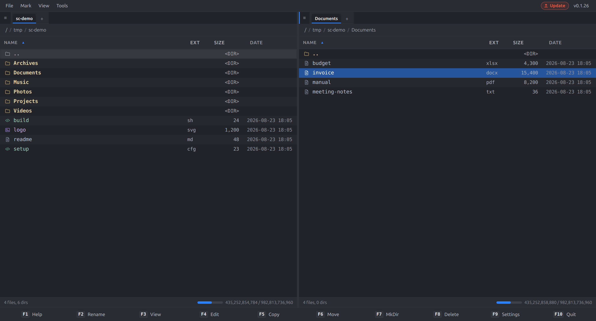

# Something Commander

A modern orthodox two-panel file manager for people who already know how to use one.

Built with Electron, React, and TypeScript. Cross-platform: **Linux** (AppImage, deb), **macOS** (zip, x64/arm64), **Windows** (NSIS).

[](https://github.com/nowherenone/something-commander/actions/workflows/build.yml)



If your formative years involved Norton Commander, DOS Navigator, FAR, or Total Commander — your muscle memory already works here. Two panels, a cursor, Insert to tag, F5 to copy, F6 to move, Alt+F1/F2 for the drive menus. The mouse is optional. It has always been optional.

## Download

Grab the latest build from the [Releases](https://github.com/nowherenone/something-commander/releases) page. The app self-updates from there — when a new release ships, the badge in the title bar tells you and one click applies it.

## The keyboard

Selection and navigation work the way they always have: **Tab** swaps panels, **Insert** or **Space** tags files, **Backspace** goes up, **Enter** descends. The classics are all there:

| Chord | Command | Chord | Command |
|------------------|--------------------|--------------------|--------------------|
| `Alt+F1` / `Alt+F2` | Drive menu (left / right) | `Ctrl+H` | Show hidden files |
| `Alt+F5` | Pack | `Ctrl+R` | Reread directory |
| `Alt+F7` | Search | `Ctrl+M` | Multi-rename tool |
| `Alt+F9` | Unpack | `Ctrl+Q` | Quick view panel |
| `Ctrl+A` | Select all | `Ctrl+1/2/3` | Brief / tree / info view |
| `Ctrl+I` | Invert selection | `Ctrl+Shift+C` | Compare directories |
| `Ctrl+T` / `Ctrl+W` | New / close tab | `Ctrl+L` | Focus address bar |
| `Ctrl+D` | Drive menu | `Ctrl+C` | Copy selected names |

Every binding is remappable in **F9 → Keybindings**, if your fingers disagree with our defaults.

### Two deliberate departures

- **Ctrl+C copies the selected file names**, not "compare directories". It's the entrenched clipboard convention; compare lives on `Ctrl+Shift+C`.
- **F2 renames** (Total Commander habit) — `Ctrl+Enter` also works.

## What it does

- **Real file operations with a queue.** Copy/move/delete run through an operation pipeline with progress, cancellation, and a minimized-operations tray — big jobs don't freeze the panels.
- **Archives as folders.** Browse into zip, 7z, tar, rar and friends; pack with `Alt+F5`, extract with `Alt+F9`.
- **Network filesystems as plugins.** SFTP, SMB, and S3 buckets mount into the same two panels — copy from a bucket to an SSH box with F5 like it's two floppies.
- **Compare directories** (`Ctrl+Shift+C`), asymmetric-copy aware, with color-coded newer/older/orphan files.
- **Multi-rename tool** (`Ctrl+M`) for the "rename 300 photos" evening.
- **F3 view / F4 edit** with a built-in viewer and editor.
- **Quick view** (`Ctrl+Q`) previews the cursor's file without leaving the list.
- **Command line** at the bottom of the panel — runs in the active panel's directory, with history. Your shell, your PATH.
- **Four themes**, including a **Classic** skin — the blue-and-yellow you're nostalgic for is one settings click away. Font, font size, and row height are configurable too, because 24px rows at 13px mono is a feature, not a bug.

## Building from source

```bash
npm install
npm run dev        # Electron + hot reload
```

### Testing

**Always run the full suite before claiming a file-ops or dialog fix works, and before every release.**

| Command | Purpose |
|---------|---------|
| `npm test` | Unit tests (vitest) — fast |
| `npm run test:visual` | Playwright visual / dialog UI tests |
| `npm run test:all` | Unit **+** visual — **required gate** |
| `npm run test:e2e:update` | Refresh screenshots after intentional UI changes |
| `npm run pre-release` | typecheck + `test:all` + production build |

- **Unit**: includes real zip→disk stream progress and cancel tests under `src/__tests__/`.
- **Visual**: Playwright opens the harness at `/#/test-harness` (no Electron). Covers operation dialog states and a live zip-progress stepper.

### Releasing

```bash
npm run pre-release    # must be green
# bump package.json version, commit
git tag vX.Y.Z
git push origin vX.Y.Z   # triggers GitHub Actions build + release
```

See **[RELEASE.md](./RELEASE.md)** for the full checklist (version bump, manual smoke, packaging, auto-update).

## License

[MIT](./LICENSE)
